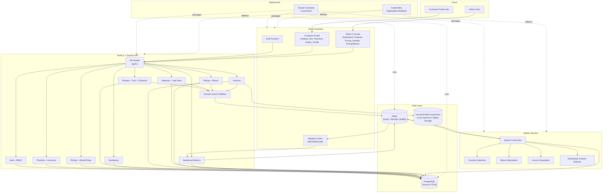
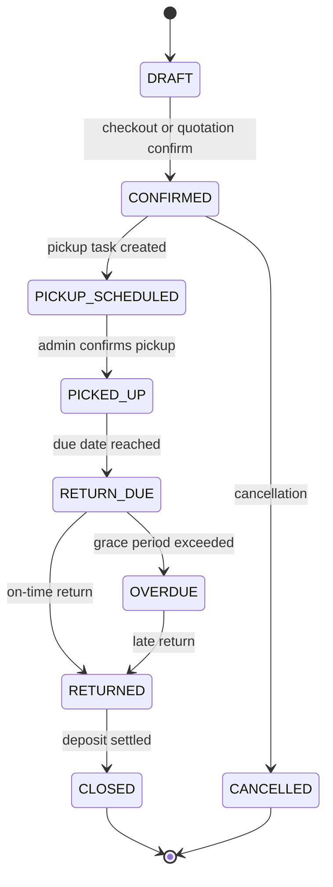
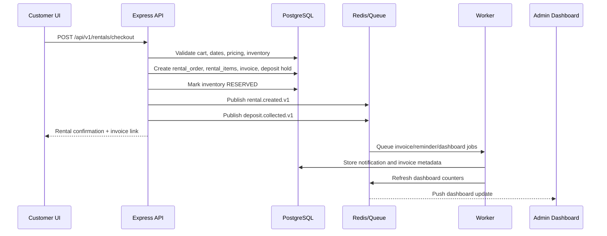
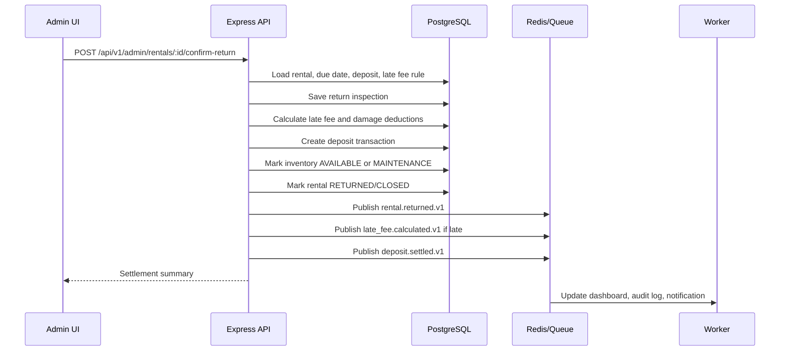
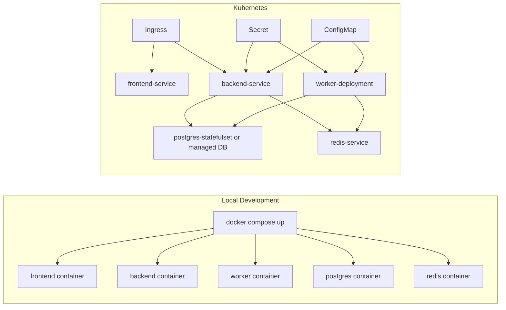

# Rental Management System - Architecture

## System Diagram

## Database Schema

```mermaid
erDiagram
  User ||--o{ Address : "has"
  User ||--o{ RentalOrder : "places"
  User ||--o{ Quotation : "requests"
  User ||--o{ Payment : "initiates"
  User ||--o{ Notification : "receives"
  User ||--o{ AuditLog : "triggers"
  User ||--o{ DepositTransaction : "authorizes"
  
  Address ||--o{ Cart : "assigned to"
  Address ||--o{ RentalOrder : "billing/shipping"
  Address ||--o{ Quotation : "destination"

  Product ||--o{ ProductVariant : "has"
  Product ||--o{ Accessory : "includes"
  Product ||--o{ PricingRule : "has base price"
  Product ||--o{ DepositRule : "has deposit fee"
  Product ||--o{ LateFeeRule : "has late fee"

  ProductVariant ||--o{ InventoryUnit : "contains units"
  ProductVariant ||--o{ PricingRule : "variant price"
  ProductVariant ||--o{ DepositRule : "variant deposit"
  ProductVariant ||--o{ LateFeeRule : "variant late fee"

  InventoryUnit ||--o{ RentalItem : "assigned to"
  InventoryUnit ||--o{ PickupTask : "linked"
  InventoryUnit ||--o{ ReturnInspection : "inspected"
  InventoryUnit ||--o{ RepairTask : "repaired"

  PriceList ||--o{ PricingRule : "sets price"
  PriceList ||--o{ DepositRule : "sets deposit"
  PriceList ||--o{ LateFeeRule : "sets late fee"
  PriceList ||--o{ CartItem : "determines cart item price"
  PriceList ||--o{ RentalItem : "determines order item price"
  PriceList ||--o{ Quotation : "determines quote price"

  RentalPeriod ||--o{ PricingRule : "defines duration"
  RentalPeriod ||--o{ CartItem : "defines cart term"
  RentalPeriod ||--o{ RentalItem : "defines order term"
  RentalPeriod ||--o{ QuotationItem : "defines quote term"

  Cart ||--o{ CartItem : "holds"
  User ||--o| Cart : "owns"

  RentalOrder ||--o{ RentalItem : "contains"
  RentalOrder ||--o{ Invoice : "bills"
  RentalOrder ||--o{ Payment : "received in"
  RentalOrder ||--o{ DepositTransaction : "adjusts"
  RentalOrder ||--o{ PickupTask : "requires"
  RentalOrder ||--o{ ReturnTask : "requires"
  RentalOrder ||--o{ Notification : "triggers updates"

  Quotation ||--o{ QuotationItem : "contains"
  RentalOrder ||--o| Quotation : "derived from"

  ReturnTask ||--o{ ReturnInspection : "performs"
  ReturnInspection ||--o{ InspectionAccessory : "checks"
  ReturnInspection ||--o{ RepairTask : "logs repair"
  Accessory ||--o{ InspectionAccessory : "checked"

  User {
    uuid id PK
    string email UK
    string passwordHash
    UserRole role
    string fullName
    string phone
    string profileImage
    boolean isActive
    datetime createdAt
    datetime updatedAt
  }
  Address {
    uuid id PK
    uuid userId FK
    string label
    string line1
    string line2
    string city
    string state
    string postalCode
    string country
    boolean isDefault
    datetime createdAt
  }
  Product {
    uuid id PK
    string name
    string slug UK
    string description
    string category
    boolean isActive
    datetime createdAt
  }
  ProductVariant {
    uuid id PK
    uuid productId FK
    string sku UK
    string brand
    string manufacturer
    string color
    string size
    json attributes
    boolean isActive
    datetime createdAt
  }
  InventoryUnit {
    uuid id PK
    uuid variantId FK
    string assetTag UK
    string qrCode UK
    InventoryStatus status
    ProductCondition condition
    string location
    datetime purchaseDate
    datetime retiredAt
    datetime createdAt
  }
  Accessory {
    uuid id PK
    uuid productId FK
    string name
    int quantity
    boolean isRequired
    datetime createdAt
  }
  PriceList {
    uuid id PK
    string name
    string description
    boolean isDefault
    datetime startsAt
    datetime endsAt
    boolean isActive
    datetime createdAt
  }
  RentalPeriod {
    uuid id PK
    string name
    RentalPeriodUnit unit
    int duration
    boolean isActive
    datetime createdAt
  }
  PricingRule {
    uuid id PK
    uuid priceListId FK
    uuid rentalPeriodId FK
    uuid productId FK
    uuid variantId FK
    decimal price
    string currency
    datetime createdAt
  }
  DepositRule {
    uuid id PK
    uuid priceListId FK
    uuid productId FK
    uuid variantId FK
    DepositRuleType type
    decimal amount
    string currency
    boolean isActive
    datetime createdAt
  }
  LateFeeRule {
    uuid id PK
    uuid priceListId FK
    uuid productId FK
    uuid variantId FK
    LateFeeUnit unit
    decimal amount
    int gracePeriodMinutes
    decimal maxFee
    string currency
    boolean isActive
    datetime createdAt
  }
  Cart {
    uuid id PK
    uuid userId FK
    uuid addressId FK
    DeliveryMethod deliveryMethod
    datetime createdAt
  }
  CartItem {
    uuid id PK
    uuid cartId FK
    uuid productId FK
    uuid variantId FK
    uuid priceListId FK
    uuid rentalPeriodId FK
    int quantity
    datetime startsAt
    datetime endsAt
    decimal unitPrice
    decimal depositAmount
    datetime createdAt
  }
  RentalOrder {
    uuid id PK
    string orderNumber UK
    uuid customerId FK
    uuid addressId FK
    RentalStatus status
    DeliveryMethod deliveryMethod
    decimal subtotal
    decimal depositTotal
    decimal lateFeeTotal
    decimal damageFeeTotal
    decimal grandTotal
    string currency
    datetime confirmedAt
    datetime pickedUpAt
    datetime returnedAt
    datetime closedAt
    datetime createdAt
  }
  RentalItem {
    uuid id PK
    uuid rentalOrderId FK
    uuid productId FK
    uuid variantId FK
    uuid inventoryUnitId FK
    uuid priceListId FK
    uuid rentalPeriodId FK
    int quantity
    datetime startsAt
    datetime endsAt
    decimal unitPrice
    decimal depositAmount
    decimal lateFeeAmount
    decimal damageFeeAmount
    RentalStatus status
    datetime createdAt
  }
  Quotation {
    uuid id PK
    string quotationNumber UK
    uuid customerId FK
    uuid createdById FK
    uuid addressId FK
    uuid priceListId FK
    uuid rentalOrderId FK
    string status
    string header
    string footer
    decimal subtotal
    decimal depositTotal
    decimal grandTotal
    datetime expiresAt
    datetime confirmedAt
    datetime createdAt
  }
  QuotationItem {
    uuid id PK
    uuid quotationId FK
    uuid productId FK
    uuid variantId FK
    uuid rentalPeriodId FK
    int quantity
    datetime startsAt
    datetime endsAt
    decimal unitPrice
    decimal depositAmount
    datetime createdAt
  }
  Invoice {
    uuid id PK
    string invoiceNumber UK
    uuid rentalOrderId FK
    InvoiceStatus status
    decimal subtotal
    decimal depositAmount
    decimal lateFeeAmount
    decimal damageFeeAmount
    decimal total
    string currency
    string pdfUrl
    datetime issuedAt
    datetime createdAt
  }
  Payment {
    uuid id PK
    uuid rentalOrderId FK
    uuid userId FK
    PaymentType type
    PaymentProvider provider
    string providerRef
    PaymentStatus status
    decimal amount
    string currency
    datetime paidAt
    datetime createdAt
  }
  DepositTransaction {
    uuid id PK
    uuid rentalOrderId FK
    uuid actorId FK
    DepositTransactionType type
    DepositStatus status
    decimal amount
    string currency
    string reason
    datetime createdAt
  }
  PickupTask {
    uuid id PK
    uuid rentalOrderId FK
    uuid inventoryUnitId FK
    uuid assignedAdminId FK
    TaskStatus status
    datetime scheduledAt
    int sequenceNumber
    string routeNotes
    json checklist
    datetime confirmedAt
    datetime createdAt
  }
  ReturnTask {
    uuid id PK
    uuid rentalOrderId FK
    uuid assignedAdminId FK
    TaskStatus status
    datetime scheduledAt
    datetime confirmedAt
    datetime createdAt
  }
  ReturnInspection {
    uuid id PK
    uuid returnTaskId FK
    uuid rentalItemId FK
    uuid inventoryUnitId FK
    ProductCondition condition
    string damageNotes
    decimal damageFeeAmount
    datetime inspectedAt
    datetime createdAt
  }
  InspectionAccessory {
    uuid id PK
    uuid returnInspectionId FK
    uuid accessoryId FK
    int expectedQuantity
    int returnedQuantity
    int missingQuantity
    string notes
    datetime createdAt
  }
  RepairTask {
    uuid id PK
    uuid inventoryUnitId FK
    uuid returnInspectionId FK
    RepairStatus status
    string description
    decimal estimatedCost
    datetime completedAt
    datetime createdAt
  }
  Notification {
    uuid id PK
    uuid userId FK
    uuid rentalOrderId FK
    string type
    string channel
    NotificationStatus status
    string subject
    string body
    datetime scheduledAt
    datetime sentAt
    datetime createdAt
  }
  AuditLog {
    uuid id PK
    uuid actorId FK
    string action
    string entityType
    uuid entityId
    json metadata
    datetime createdAt
  }
```

## Rental Lifecycle

## Checkout Sequence

## Return And Deposit Settlement Sequence

## Deployment View

## Architectural Decisions

- Start as a modular monolith to maximize hackathon velocity.
- Keep queue, worker, and event boundaries explicit so it can be explained as scalable architecture.
- Use PostgreSQL as the only source of truth for business state.
- Use Redis for derived/realtime state, not irreplaceable rental data.
- Use BullMQ on Redis for background jobs unless the team strongly prefers RabbitMQ.
- Use SSE for dashboard realtime updates because it is simpler than WebSockets for one-way admin updates.
- Mock payment processing for the hackathon unless real payment integration is a judging requirement.
- Generate invoices server-side and expose a stable download URL.

